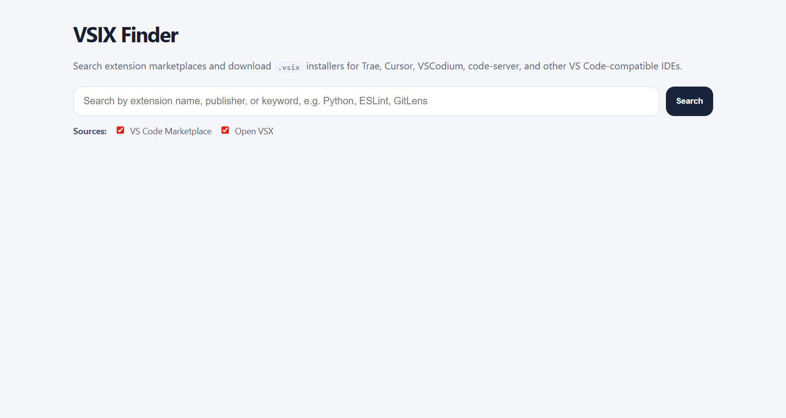
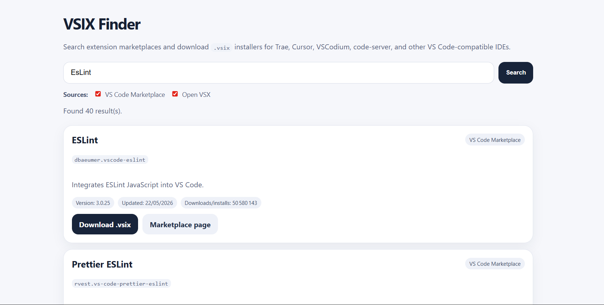

# VSIX Finder

## Live demo

You can use VSIX Finder online here:

[https://vsix-finder.onrender.com](https://vsix-finder.onrender.com)

> Note: the free hosting instance may sleep after inactivity. If the page takes a few seconds to load, wait and refresh once.

**VSIX Finder** (By @[Hlabs](https://github.com/hlabsdev)) is a small local web app that helps you search VS Code extension marketplaces and download extension installer files as `.vsix` packages.

It is useful when you are using a VS Code-compatible IDE such as **Trae**, **Cursor**, **VSCodium**, **code-server**, or another editor where some extensions may not appear in the built-in extension marketplace.

The goal is simple:

> Search for an extension by name or keyword, then download its `.vsix` file so you can install it manually in another VS Code-based IDE.

---

## Why this project exists

Some VS Code-based IDEs do not expose the full official Visual Studio Code Marketplace inside their own extension store.

For example, Trae allows users to manage extensions from its extension panel, but if an extension is not available directly inside Trae, a common workaround is to manually download the extension package as a `.vsix` file and install it manually.

VSIX Finder makes that process easier by providing a simple search and download interface.

---

## Features

- Search extensions by name, publisher, or keyword
- Search across multiple extension registries:
  - Visual Studio Code Marketplace
  - Open VSX Registry
- Download extensions directly as `.vsix` files
- Simple local web interface
- No database
- No account required
- No third-party npm dependencies
- Runs locally on your machine

---

## Supported marketplaces

### Visual Studio Code Marketplace

The official marketplace used by Microsoft Visual Studio Code.

### Open VSX Registry

An open-source extension registry commonly used by VS Code-compatible editors and open-source IDE distributions.

---

## Screenshots

### Home page



### Search results



---

## Requirements

You need **Node.js 18 or newer**.

Check your version:

```bash
node -v
```

---

## Installation

Clone the repository:

```bash
git clone https://github.com/hlabsdev/vsix-finder.git
cd vsix-finder
```

Install dependencies:

```bash
npm install
```

> Note: this project currently has no external npm dependencies, but running `npm install` is still safe and standard.

---

## Run the app

Start the local server:

```bash
npm start
```

Then open this URL in your browser:

```text
http://localhost:3434
```

You should see the VSIX Finder search interface.

---

## Use a custom port

By default, the app runs on port `3434`.

On Linux/macOS:

```bash
PORT=5050 npm start
```

On Windows PowerShell:

```powershell
$env:PORT=5050; npm start
```

Then open:

```text
http://localhost:5050
```

---

## How to use

1. Open the app in your browser.
2. Type the name or keyword of an extension.
   - Example: `Python`
   - Example: `ESLint`
   - Example: `GitLens`
3. Select the marketplaces you want to search.
4. Click **Search**.
5. Click **Download .vsix** on the extension you want.
6. Install the downloaded `.vsix` file manually in your VS Code-compatible IDE.

---

## Installing a `.vsix` file manually

### In Trae

1. Open Trae.
2. Go to the Extensions area.
3. Drag and drop the downloaded `.vsix` file into the extension panel/store.
4. Follow the installation prompt.

### In VS Code

From the command line:

```bash
code --install-extension path/to/extension.vsix
```

Or from the UI:

1. Open the Extensions panel.
2. Click the `...` menu.
3. Select **Install from VSIX...**
4. Choose the downloaded `.vsix` file.

### In VSCodium

```bash
codium --install-extension path/to/extension.vsix
```

### In code-server

```bash
code-server --install-extension path/to/extension.vsix
```

---

## Project structure

```text
vsix-finder/
  index.html
  server.js
  package.json
  README.md
```

### `index.html`

Contains the user interface.

### `server.js`

Runs the local HTTP server, performs marketplace searches, and proxies `.vsix` downloads.

### `package.json`

Defines the project metadata and npm start command.

---

## API endpoints

### Search extensions

```text
GET /api/search?q=python&sources=vscode,openvsx
```

Query parameters:

| Parameter | Description |
|---|---|
| `q` | Search keyword |
| `sources` | Comma-separated list of sources: `vscode`, `openvsx` |

Example:

```text
http://localhost:3434/api/search?q=eslint&sources=vscode,openvsx
```

### Download extension

```text
GET /api/download?source=vscode&publisher=publisherName&name=extensionName&version=1.0.0
```

This endpoint downloads the selected extension as a `.vsix` file.

---

## Important notes

Some extensions may not work in every VS Code-compatible IDE.

Possible reasons include:

- the extension depends on Microsoft-specific VS Code APIs;
- the extension has marketplace licensing restrictions;
- the extension requires a newer VS Code engine version;
- the IDE does not support a specific extension capability yet.

If an extension does not install correctly, try:

1. downloading an earlier version;
2. checking whether the same extension exists on Open VSX;
3. searching for an open-source alternative extension.

---

## Limitations

This tool is intentionally simple.

It does not currently include:

- authentication;
- extension version history browsing;
- automatic installation into an IDE;
- background updates;
- extension compatibility validation;
- a hosted public backend.

The app is designed to run locally.

---

## Security and privacy

VSIX Finder runs on your machine.

It does not store search history, downloaded files, or personal data.

The app only contacts extension marketplaces when you perform a search or download a `.vsix` file.

---

## Recommended use case

Use this project when:

- an extension is missing from your IDE marketplace;
- you need to manually install an extension in Trae, Cursor, VSCodium, or code-server;
- you want to compare availability between the VS Code Marketplace and Open VSX;
- you want a fast way to download `.vsix` packages.

---

## Roadmap ideas

Possible future improvements:

- Add extension version selector
- Add extension icons
- Add direct compatibility information
- Add search filters by publisher
- Add sorting by installs, downloads, or update date
- Add Docker support
- Add one-click copy command for manual installation

---

## Contributing

Contributions are welcome.

You can contribute by:

- reporting bugs;
- suggesting marketplace sources;
- improving the UI;
- adding compatibility checks;
- improving documentation.

To contribute:

```bash
git checkout -b feature/my-improvement
git add .
git commit -m "Add my improvement"
git push origin feature/my-improvement
```

Then open a pull request.

---

## Deploy your own instance

You can deploy your own instance for free on Render.

Recommended settings:

- Runtime: Node
- Build command: `npm install`
- Start command: `npm start`
- Environment variable: none required

The app automatically uses the `PORT` provided by the hosting platform.

---

## License

MIT License.

You are free to use, modify, and distribute this project.

---

## Disclaimer

This project is not affiliated with Microsoft, Visual Studio Code, Open VSX, Trae, Cursor, VSCodium, or code-server.

All trademarks belong to their respective owners.

Use downloaded extensions according to their marketplace terms and individual extension licenses.
